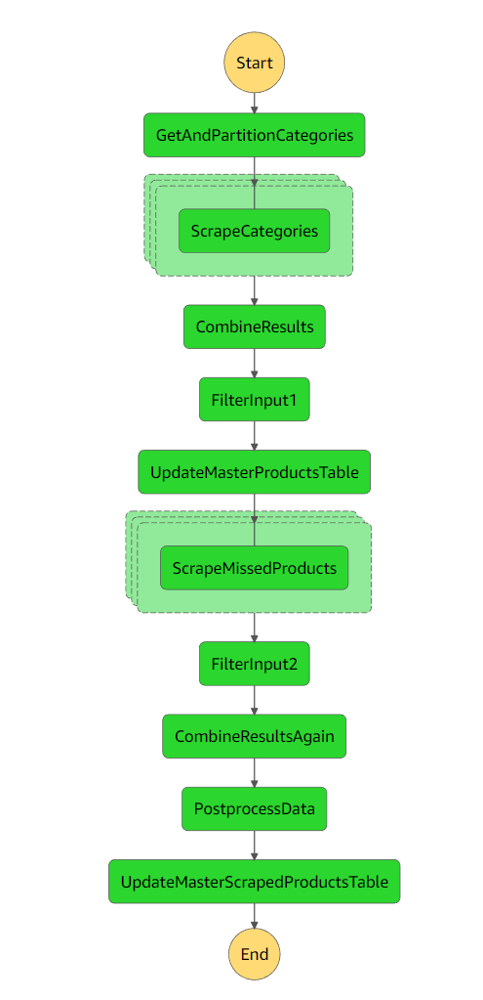
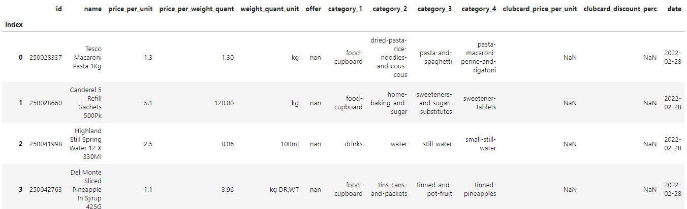

# Tesco website product scraper
[](https://forthebadge.com) [](https://forthebadge.com)

:warning: This application requires a UK-based residential proxy as Tesco's website blocks access based on IP addresses :warning:

The purpose of this project is to create an AWS-based serverless application that scrapes product pricing and category details from Tesco's website. The core functionality is an AWS Step Function that runs AWS Lambda functions in a sequence and is scheduled to run on a user-defined frequency using an EventBridge rule, AWS SAM is used to create all the necessary AWS resources to get this application up and running. In the event that the state machine fails, an alarm will be sent to the email used to set up SNS notifications.

At its core, the application consists of seven Lambda functions, a Lambda layer containing commonly used functions across the functions, a Step Function which orchestrates the pipeline, and an AWS SAM template which creates and deploys all the AWS resources. These are contained in the following riles and folders:

- functions - Folder containing subfolders, which of which contains code for a Lambda function.
- statemachines - Definition for the state machine that orchestrates the product scraping pipeline.
- util_layer - Utility functions that are shared across Lambda functions.
- template.yaml - A template that defines the application's AWS resources.

## Pipeline overview
<p align="center">
  
</p>
<p align = "center">
Visualisation of the steps in the state machine. 
</p>
<br/>

The steps in the pipeline are defined in the `statemachine/tesco_scrape_pipeline.asl.json` file. There are a total of 10 steps in the pipeline, 8 of which use Lambda functions. In brief, the main steps of the pipeline are:

1. Get all the broad categories of products [from this link](https://www.tesco.com/groceries/en-GB/shop), find out how many pages of products there are for each category, and partition the pages into lists.
2. For each partition, go through every page in it and from each page get the details of the products on it. The resulting scraped data for a partition is then saved into an S3 bucket. [Here's an example of one page in a partition](https://www.tesco.com/groceries/en-GB/shop/fresh-food/all). Currently designed to run two partitions concurrently.
3. Combine the scraped outputs from each partition into one JSON file and save it into the same S3 bucket.
4. Update a master product table which is a table containing product IDs and their correponding product name. If one doesn't exist then create one using the output from step 4.
5. Using the master product table, identify if any products have been missed during step 2 and scrape the pages of missed products. If a product's page can't be accessed then remove it from the master product tables as it's assumed the product is discontinued.
6. Combine the resulting outputs of the previous step into one JSON file and save into the S3 bucket.
7. Load in the combined outputs from step 3 and 6, calculate the Clubcard discount percentage if there is one, add a column for the current date, and save as a CSV file.
8. Update the master scraped data table using the output of step 7. If it doesn't exist, then create it using the output of step 7.

<br/>
The final file contains the following columns:

| Column name  | Data type | Description |
| ----------- | ---------- | ----------- |
| id  | integer  | Product ID  |
| name  | string  | Product name  |
| price_per_unit  | float  | Price of the product  |
| price_per_weight_quant  | float  | Price per unit  |
| weight_quant_unit  | string  | Unit description (e.g., kg)  |
| offer  | string  | Offer currently available on product   |
| category_1  | string  | Primary category of product  |
| category_2  | string  | Secondary category of product  |
| category_3  | string  | Tertiary category of product |
| category_4  | string  | Quaternary category of product  |
| clubcard_price_per_unit  | float  | Clubcard price of product  |
| clubcard_discount_perc  | float  | Clubcard discount percentage  |
| date  | string  | Content Cell  |

<br/>
<p align="center">
  
</p>
<p align = "center">
Snippet of the master scraped data table. 
</p>

## Pre-requisites

1. An AWS account
2. SAM CLI - [Install the SAM CLI](https://docs.aws.amazon.com/serverless-application-model/latest/developerguide/serverless-sam-cli-install.html)
3. Python 3 - [Install Python 3](https://www.python.org/downloads/)
4. Docker - [Install Docker community edition](https://hub.docker.com/search/?type=edition&offering=community)
6. A JSON file named named `"sock5_proxy.json"` containing a SOCKS5 proxy details with the following structure:

    ```yaml
    {
        "username": "PUT_USERNAME_HERE"           # Username for proxy as string
        "password": "PUT_PASSWORD_HERE"           # Password for proxy as string
        "address": "PUT_IPv4_PROXY_ADDRESS_HERE"  # IPv4 proxy address as string
        "port": PUT_PROXY_SERVER_PORT_HERE        # Port number needed to communicate with proxy server as integer
        "expiry": "PUT_PROXY_EXPIRY_DATE_HERE"    # Expiry date of proxy in "YYYY-MM-DD" format as string
    }

## Configurations

The `template.yaml` contains the following user-defined global environment variables:

- `PROXY_DETAILS_KEY` - The filename of the JSON file which contains a SOCKS5 proxy details, the structure of which is defined in the pre-requisites section above, set to `"sock5_proxy.json"` by default.
- `USER_AGENTS_KEY` - The filename of the pickle file which contains a list of user agents to use when making URL requests.


## Build the application

The Serverless Application Model Command Line Interface (SAM CLI) is needed to build and deploy this application. Build this application with the `sam build --use-container` command. The `use-container` option makes it so that the build happens inside a Lambda-like container.

```bash
sam build --use-container
```

For each of the Lambda functions, the SAM CLI installs dependencies defined in `requirements.txt`, creates a deployment package, and saves it in the `.aws-sam/build` folder.

## Deploy the application

To deploy the application for the first time, run the following command in your shell after building:

```bash
sam deploy --guided
```

This command will package and deploy this application to AWS, with a series of prompts:

* **Stack Name**: The name of the stack to deploy to CloudFormation. This should be unique to your account and region, and a good starting point would be something matching this project's function.
* **AWS Region**: The AWS region you want to deploy this app to.
* **SNS Email Parameter**: The email address to send execution failure notifications.
* **Confirm changes before deploy**: If set to yes, any change sets will be shown to you before execution for manual review. If set to no, the AWS SAM CLI will automatically deploy application changes.
* **Allow SAM CLI IAM role creation**: Many AWS SAM templates, including this one, create AWS IAM roles required for the AWS Lambda function(s) included to access AWS services. By default, these are scoped down to minimum required permissions. To deploy an AWS CloudFormation stack which creates or modifies IAM roles, the `CAPABILITY_IAM` value for `capabilities` must be provided. If permission isn't provided through this prompt, to deploy this example you must explicitly pass `--capabilities CAPABILITY_IAM` to the `sam deploy` command.
* **Save arguments to samconfig.toml**: If set to yes, your choices will be saved to a configuration file inside the project, so that in the future you can just re-run `sam deploy` without parameters to deploy changes to this application.

You can find more information and examples about filtering Lambda function logs in the [SAM CLI Documentation](https://docs.aws.amazon.com/serverless-application-model/latest/developerguide/serverless-sam-cli-logging.html).

## Cleanup

To delete the sample application that you created, use the AWS CLI. Assuming you used your project name for the stack name, you can run the following:

```bash
aws cloudformation delete-stack --stack-name tesco-product-scrape
```
